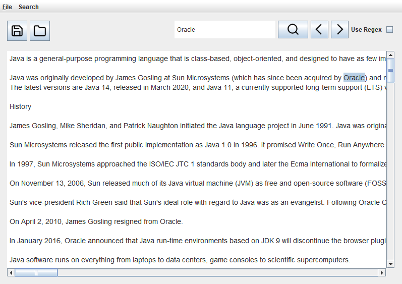

# Notepad Nano
A text editor written in Java with the SWING library. \
Includes a file picker, multithreading and search functionality.\
Definitely my hardest project yet, but still lots of fun to write.\
\
\
\
Download the releases [here](https://github.com/SpicyChair/notepad-nano/releases/tag/release)

